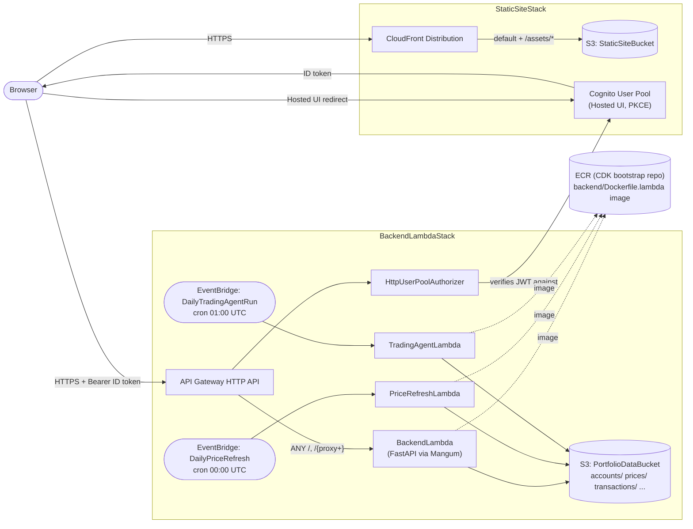
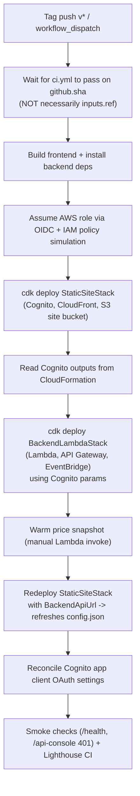

# AllotMint 🌱💷

[](https://github.com/leonarduk/allotmint/actions/workflows/ci.yml)
[](https://codecov.io/gh/leonarduk/allotmint)
[](LICENSE)

AllotMint is a family investing platform with a FastAPI backend, React/TypeScript frontend, and AWS deployment support.

## Language guidelines

All code, comments, commit messages, documentation, and PR/issue text in this
repository must be written in English only, regardless of the contributor's
or AI agent's default language.

- **Contributing**: [docs/CONTRIBUTING.md](docs/CONTRIBUTING.md) — environment variables, code quality expectations, and first PR walkthrough
- **Product and architecture overview**: [docs/README.md](docs/README.md)
- **Local setup and contributor workflow**: [docs/CONTRIBUTOR_RUNBOOK.md](docs/CONTRIBUTOR_RUNBOOK.md) — installation, running locally, testing, and pre-deploy checks
- **Deployment guide**: [docs/DEPLOY.md](docs/DEPLOY.md) — AWS CDK, environment setup, troubleshooting, and IAM permissions
- **User-oriented setup/readme**: [docs/USER_README.md](docs/USER_README.md)

## AWS architecture

Two independent CDK stacks (`cdk/stacks/static_site_stack.py`, `cdk/stacks/backend_lambda_stack.py`) make up the deployed system. The frontend is served by CloudFront directly from S3; the backend is a separate, CloudFront-less HTTP API. Cognito issues the ID token the browser sends as a bearer token; API Gateway verifies it before Lambda ever runs.



`/health`, `/config` (GET), `/token/google`, and `/signup/*` bypass the Cognito authorizer (public or self-authenticating routes); every other route requires a valid Cognito ID token.

### CDK deployment pipeline

Deploys run from `.github/workflows/deploy-lambda.yml` on a `v*` tag push (or manual dispatch), gated on a `ci.yml` run passing first. That gate checks `ci.yml` for `github.sha` — the commit that triggered the workflow run — while the later checkout step uses `inputs.ref || github.ref` (`.github/workflows/deploy-lambda.yml` lines 30-31, 134-137). For a plain tag push these are the same commit, but a manual `workflow_dispatch` that sets `inputs.ref` to a different tag/branch/SHA than the one the dispatch itself ran from will deploy a commit whose CI status was never checked by this gate.



A static, non-interactive copy of the topology is kept at [docs/aws-architecture.svg](docs/aws-architecture.svg) for contexts that can't render Mermaid.

## Design decisions

Key architectural tradeoffs made in this project:

- **JSON file storage over a relational DB**: AllotMint is a single-user tool with no concurrency requirements, so a relational database would add operational overhead without a corresponding benefit. Flat JSON keeps local dev dependency-free and makes fixture data trivial to inspect and edit by hand.
- **Cognito over custom auth**: Using AWS Cognito offloads JWT lifecycle management, MFA, and token rotation to a managed service rather than maintaining that logic in-house. The tradeoff is vendor lock-in to AWS's auth model and APIs.
- **Lambda + Mangum over a persistent server**: A pay-per-invocation Lambda fits the cost model of a low-traffic personal tool far better than an always-on server. The tradeoff is cold start latency, most notably the ~10-second Lambda INIT phase constraint tracked in [issue #4429](https://github.com/leonarduk/allotmint/issues/4429).
- **What would change at scale**: multi-user or high-traffic usage would justify swapping JSON storage for Postgres, introducing a proper job queue for background work, and splitting the single Lambda into per-domain functions to isolate cold starts and scaling behavior.

## Local development

This project uses JSON files under `data/` as its local "database" (see [JSON file storage](#design-decisions) above) — there's no local database server to set up.

- Inspect a fixture, e.g. an account's holdings: `cat data/accounts/demo/isa.json | jq '.'` (each owner under `data/accounts/<owner>/` has one JSON file per account type, e.g. `isa.json`, `sipp.json`)
- Edit fixture data directly with any text editor — e.g. add a position by editing the relevant JSON file under `data/accounts/<owner>/`
- Most routes read fixtures straight from disk, so edits take effect on your next request; a few expensive report pages are cached separately under `data/cache/` and refresh on a timer (see `backend/utils/page_cache.py`)
- Run the app against these fixtures with `bash scripts/bash/run-local-api.sh` (backend) and `npm --prefix frontend run dev` (frontend) — see [docs/CONTRIBUTOR_RUNBOOK.md](docs/CONTRIBUTOR_RUNBOOK.md) for the full local setup

## Coverage reporting

GitHub Actions uploads both backend (`coverage.xml`) and frontend (`frontend/coverage/lcov.info`) coverage reports to Codecov on pull requests and pushes to `main`.

## Local Docker development

Run the full AllotMint stack (backend + frontend) with real local fixture data.

### Prerequisites

- Docker Engine 24+
- Docker Compose v2 (`docker compose`)

### Quick start

1. Copy local environment defaults:

   ```bash
   cp .env.local.example .env.local
   ```

2. Start both services:

   ```bash
   make local-up
   ```

3. Open:

   - Frontend UI: http://localhost:3000
   - Backend API console (Swagger UI): http://localhost:8000/api-console
     (the default `/docs` route is disabled; `.env.local.example` sets
     `DISABLE_AUTH` and `LOCAL_LOGIN_EMAIL` so the console loads without a
     real login)

The backend bind-mounts `./data`, `./config.yaml`, and `./backend` into the
container, and runs with `--reload`, so both fixture data and code edits are
picked up live from your local repository checkout without rebuilding the
image.

### Stop services

```bash
make local-down
```

## Local network setup (LAN testing)

Use these steps when you want phones/tablets/laptops on your WiFi network to hit a backend running on your development machine.

### Prerequisites

- Python 3.11+ with dependencies installed:
  - `python -m pip install -r requirements.txt -r requirements-dev.txt`
  - (CI uses Python 3.12 as the primary backend version and runs a lightweight Python 3.11 compatibility smoke job)
- Node.js 20+ for frontend tooling.
- Local environment defaults:
  - `cp .env.local.example .env.local`

### Steps

1. Set runtime API base URL for the frontend in `frontend/public/config.json`:

   ```json
   {
     "apiBaseUrl": "http://<YOUR-LAN-IP>:8000"
   }
   ```

2. Start the backend and bind to all interfaces (`0.0.0.0`):

   ```bash
   bash scripts/bash/run-local-api.sh
   ```

3. Start the frontend:

   ```bash
   npm --prefix frontend run dev -- --host 0.0.0.0
   ```

4. Allow inbound TCP `8000` in your machine firewall so other LAN devices can reach the FastAPI backend.

### Notes

- `frontend/public/config.json` is fetched with `cache: "no-store"` in the SPA bootstrap and deployed with `Cache-Control: no-cache, no-store, must-revalidate` in CDK, so backend URL changes should take effect immediately.
- iOS Safari blocks mixed content (`https://...` frontend calling `http://...` API). For LAN testing, serve frontend over HTTP (or use HTTPS end-to-end).
- This project does not currently register a service worker, so `/config.json` is not intercepted by client-side SW caching.
