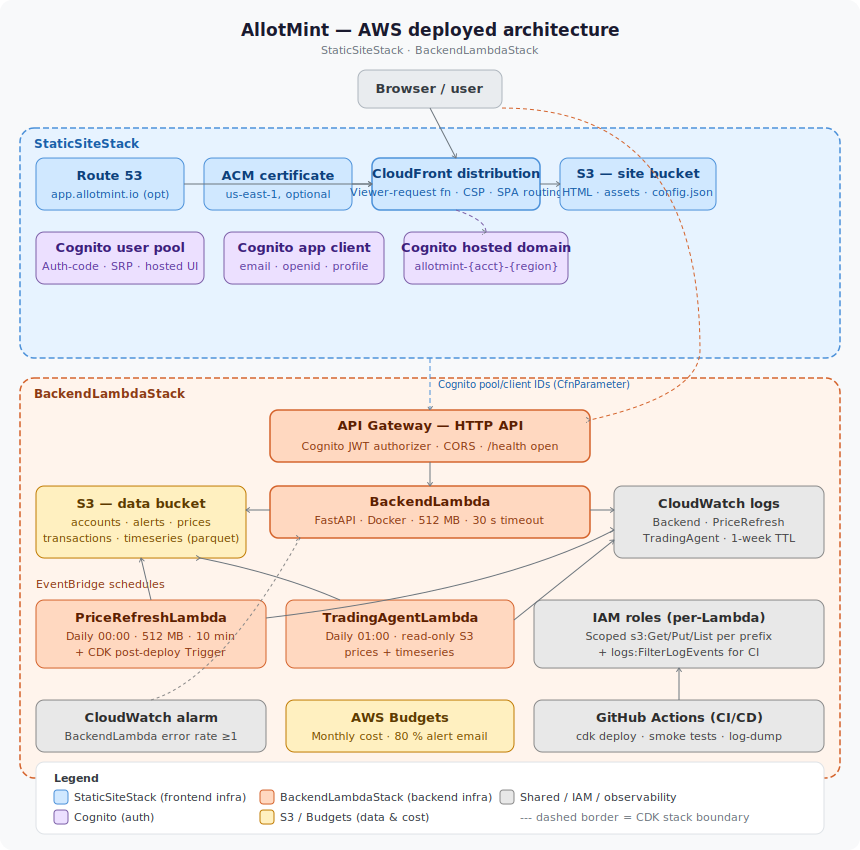

# AllotMint 🌱💷

[](https://github.com/leonarduk/allotmint/actions/workflows/ci.yml)
[](https://codecov.io/gh/leonarduk/allotmint)
[](LICENSE)

AllotMint is a family investing platform with a FastAPI backend, React/TypeScript frontend, and AWS deployment support.

## Language guidelines

All code, comments, commit messages, documentation, and PR/issue text in this
repository must be written in English only, regardless of the contributor's
or AI agent's default language.

- **Contributing**: [docs/CONTRIBUTING.md](docs/CONTRIBUTING.md) — environment variables, code quality expectations, and first PR walkthrough
- **Product and architecture overview**: [docs/README.md](docs/README.md)
- **Local setup and contributor workflow**: [docs/CONTRIBUTOR_RUNBOOK.md](docs/CONTRIBUTOR_RUNBOOK.md) — installation, running locally, testing, and pre-deploy checks
- **Deployment guide**: [docs/DEPLOY.md](docs/DEPLOY.md) — AWS CDK, environment setup, troubleshooting, and IAM permissions
- **User-oriented setup/readme**: [docs/USER_README.md](docs/USER_README.md)

## AWS architecture



> StaticSiteStack (CloudFront, S3, Cognito) and BackendLambdaStack (API Gateway, Lambda, EventBridge, S3 data bucket, CloudWatch, Budgets, ECR).

## Coverage reporting

GitHub Actions uploads both backend (`coverage.xml`) and frontend (`frontend/coverage/lcov.info`) coverage reports to Codecov on pull requests and pushes to `main`.

## Local Docker development

Run the full AllotMint stack (backend + frontend) with real local fixture data.

### Prerequisites

- Docker Engine 24+
- Docker Compose v2 (`docker compose`)

### Quick start

1. Copy local environment defaults:

   ```bash
   cp .env.local.example .env.local
   ```

2. Start both services:

   ```bash
   make local-up
   ```

3. Open:

   - Frontend UI: http://localhost:3000
   - Backend API console (Swagger UI): http://localhost:8000/api-console
     (the default `/docs` route is disabled; `.env.local.example` sets
     `DISABLE_AUTH` and `LOCAL_LOGIN_EMAIL` so the console loads without a
     real login)

The backend bind-mounts `./data`, `./config.yaml`, and `./backend` into the
container, and runs with `--reload`, so both fixture data and code edits are
picked up live from your local repository checkout without rebuilding the
image.

### Stop services

```bash
make local-down
```

## Local network setup (LAN testing)

Use these steps when you want phones/tablets/laptops on your WiFi network to hit a backend running on your development machine.

### Prerequisites

- Python 3.11+ with dependencies installed:
  - `python -m pip install -r requirements.txt -r requirements-dev.txt`
  - (CI uses Python 3.12 as the primary backend version and runs a lightweight Python 3.11 compatibility smoke job)
- Node.js 20+ for frontend tooling.
- Local environment defaults:
  - `cp .env.local.example .env.local`

### Steps

1. Set runtime API base URL for the frontend in `frontend/public/config.json`:

   ```json
   {
     "apiBaseUrl": "http://<YOUR-LAN-IP>:8000"
   }
   ```

2. Start the backend and bind to all interfaces (`0.0.0.0`):

   ```bash
   bash scripts/bash/run-local-api.sh
   ```

3. Start the frontend:

   ```bash
   npm --prefix frontend run dev -- --host 0.0.0.0
   ```

4. Allow inbound TCP `8000` in your machine firewall so other LAN devices can reach the FastAPI backend.

### Notes

- `frontend/public/config.json` is fetched with `cache: "no-store"` in the SPA bootstrap and deployed with `Cache-Control: no-cache, no-store, must-revalidate` in CDK, so backend URL changes should take effect immediately.
- iOS Safari blocks mixed content (`https://...` frontend calling `http://...` API). For LAN testing, serve frontend over HTTP (or use HTTPS end-to-end).
- This project does not currently register a service worker, so `/config.json` is not intercepted by client-side SW caching.
